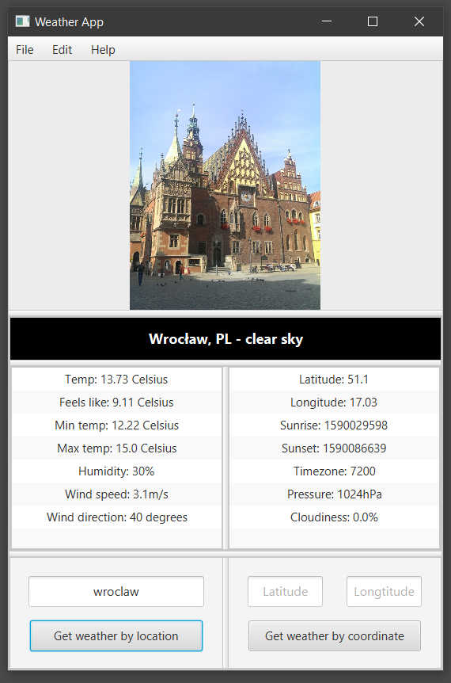

# Weather GUI Application

### ! Compile with JDK 8 !
A GUI program build with JavaFX, using RESTful APIs (OpenWeather and Google Places API) to retrieve the weather data along with location images, litte crappy.

